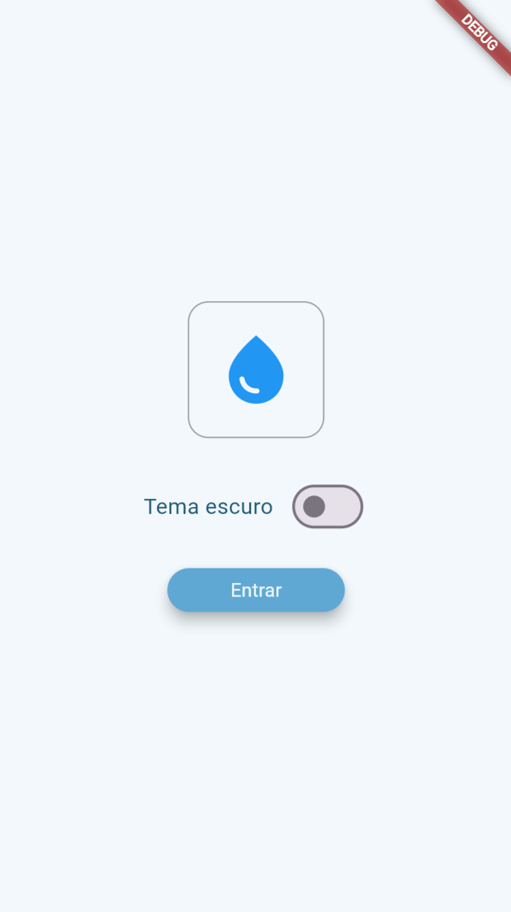
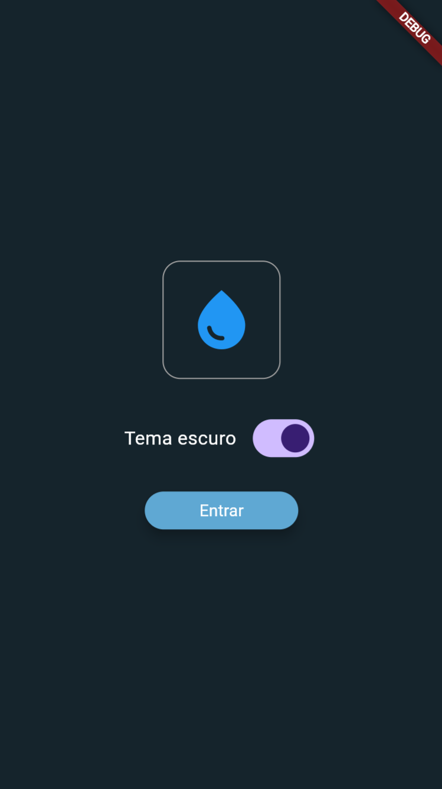
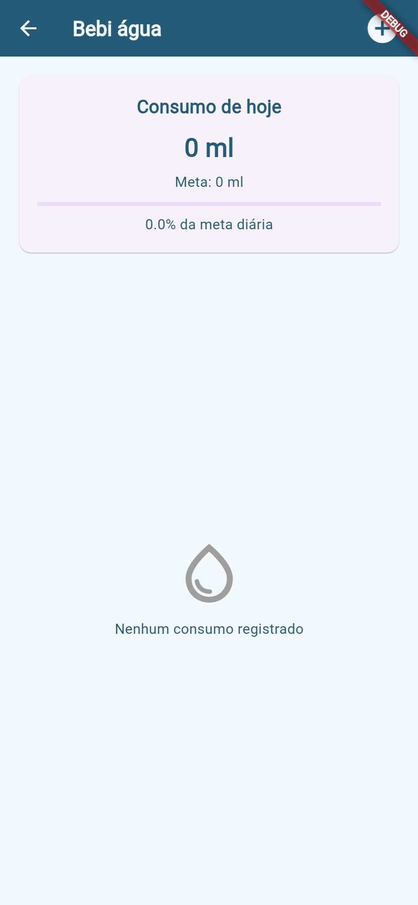
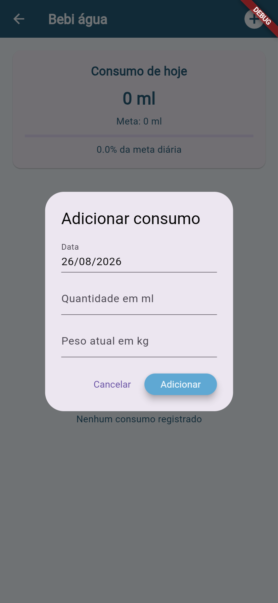
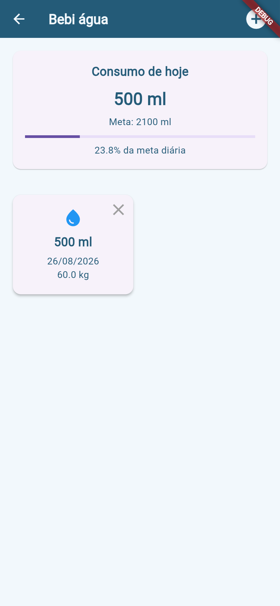
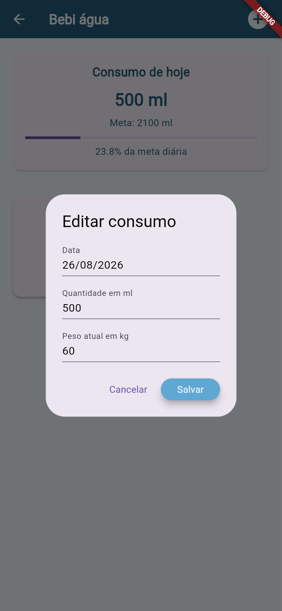

# Bebi Água

Esse é um aplicativo feito em Flutter para ajudar no controle do consumo diário de água.

No app, é possível registrar a data, a quantidade de água consumida em ml e o peso atual. Com essas informações, o aplicativo calcula automaticamente a meta diária de água usando a recomendação de **35 ml por kg corporal** e mostra a porcentagem dessa meta que já foi atingida.

## Tecnologias

* Flutter
* Dart
* SharedPreferences
* Material Design

## Funcionalidades

* Tela Splash
* Tema claro e escuro
* Cadastro do consumo de água
* Lista de registros em formato de cartões
* Exclusão de registros
* Edição de um registro ao clicar no cartão
* Cálculo da meta diária de água
* Exibição do total consumido no dia
* Exibição da porcentagem da meta atingida
* Armazenamento local dos registros

## Como funciona o cálculo

A meta diária é calculada assim:

```text
35 ml × peso atual
```

Por exemplo, uma pessoa com 60 kg tem a seguinte meta:

```text
35 × 60 = 2100 ml
```

Se ela beber 1050 ml:

```text
1050 ÷ 2100 × 100 = 50%
```

Então ela atingiu **50% da meta diária**.

## Passos para testar

1. Abra o projeto no Visual Studio Code.

2. Abra o terminal dentro da pasta do projeto.

3. Instale as dependências:

```bash
flutter pub get
```

4. Rode o aplicativo no Chrome usando uma porta fixa:

```bash
flutter run -d chrome --web-port 8080
```

A porta fixa ajuda a manter o armazenamento local do navegador durante os testes.

5. Na tela inicial:

   * Teste o botão de tema escuro.
   * Clique em **Entrar**.

6. Na tela principal, clique no botão `+`.

7. Cadastre um consumo. Exemplo:

```text
Data: data de hoje
Quantidade: 500
Peso: 60
```

8. Clique em **Adicionar**.

9. Cadastre outro registro:

```text
Data: data de hoje
Quantidade: 550
Peso: 60
```

10. Confira se o total consumido ficou:

```text
1050 ml
```

11. Confira se a meta diária ficou:

```text
2100 ml
```

12. A porcentagem deve aparecer como:

```text
50%
```

13. Clique em um cartão para testar a edição.

14. Altere alguma informação e clique em **Salvar**.

15. Clique no ícone de exclusão para testar a remoção de um registro.

16. Para testar o armazenamento local, deixe alguns registros cadastrados.

17. No terminal, pressione:

```text
q
```

e depois `Enter`.

18. Rode novamente usando a mesma porta:

```bash
flutter run -d chrome --web-port 8080
```

19. Clique em **Entrar**.

Se os registros continuarem aparecendo, o armazenamento local está funcionando.

## Prints das telas

### Tela inicial



### Tela Inicil Escura



### Tela principal



### Cadastro de consumo



### Cadastro Home



### Edição de consumo


